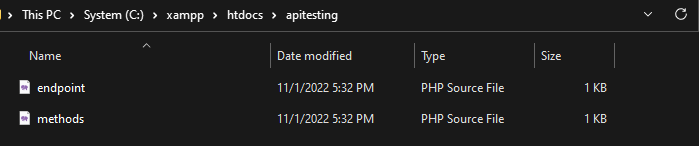

# Application Programming Interface
## Nama : Ridho Pandhu Afrianto
## NIM  : 162112133062
------------------------

# 1. Percobaan GET Data Mahasiswa


* Masukkan file-file yang dibutuhkan ke dalam `/xampp/htdocs/<namaFolderMu>/`

## methods.php
```php
<?php

class Mahasiswa
{
    public function get_mhss()
    {

        $data = "Hore aku API";

        $response = array(
            'status' => 1,
            'message' => 'Get List Mahasiswa Success.',
            'data' => $data
        );

        header('Content-Type: application/json');
        echo json_encode($response);
    }
}
```
* Program akan mengeluarkan semua elemen yang berada di dalam variabel `$response` jika GET berhasil dieksekusi.

## endpoint.php
```php
<?php
require_once "methods.php";
$mhs = new Mahasiswa();
$requst_method = $_SERVER["REQUEST_METHOD"];
switch ($requst_method) {
    case 'GET':
        $mhs->get_mhss();
        break;
    case 'POST':
        if (!empty($_GET["id"])) {
            $id = intval($_GET["id"]);
            $mhs->update_mhs($id);
        } else {
            $mhs->insert_mhs();
        }
        break;

    case 'DELETE':
        $id = intval($_GET["id"]);
        $mhs->delete_mhs($id);
        break;

    default:
        header("HTTP/1.0 405 Method Not Allowed");
        break;
        break;
}

```
* `require_once "methods.php";` digunakan untuk menghubungkan endpoint dengan method yang sudah tersedia.
* Dalam `endpoint.php` ini terdapat beberapa deklarasi http method yang legal untuk digunakan oleh client.
* Jika client memasukkan http method yang tidak ada, maka program akan mengeluarkan `"HTTP/1.0 405 Method Not Allowed"`

## XAMPP

* START modul Apache melalui XAMPP

## GET METHOD
```json
{
    "status": 200,
    "message": "Get List Mahasiswa Success.",
    "data": "Hore aku API"
}
```
* Output dari `endpoint.php`
---

# 2. POST Data Mahasiswa

## methods.php

```php
<?php

class Mahasiswa
{
    public function get_mhss()
    {
        // $data="Hore aku API";
        $semuaDataMahasiswa = [];
        if (file_exists("data.json")) {

            $jsonFile = file_get_contents('data.json');
            $semuaDataMahasiswa = json_decode($jsonFile, true);
        } 

        $response=[
            'status' => 200,
            'message' => 'Get List Mahasiswa Success.',
            'data' => $semuaDataMahasiswa
        ];

        header('Content-Type: application/json');
        echo json_encode($response); //return json
        
    }

    public function insert_mhs(string $nama, string $nim): void
    {
        $dataMhs[] = [
            'id'=> 1,
            'nama' => $nama,    
            'nim' => $nim,
        ];

        $responseArray = [
            "status" => 400,
            "message" => "Oops! Error creating json file..."
        ];
        
        if (!file_exists("data.json")) {
            if (file_put_contents("data.json", json_encode($dataMhs))) {
                $responseArray['message'] = "JSON file created successfully...";
                $responseArray['status'] = 200;
            }

        } else {
            $jsonFile = file_get_contents('data.json');
            $tempArray = json_decode($jsonFile, true);
            $dataMhs[0]["id"] = count($tempArray)+1;
            array_push($tempArray, $dataMhs[0]);
            $jsonData = json_encode($tempArray);
            if(file_put_contents('data.json', $jsonData)) {
                $responseArray['message'] = "Data inputted to JSON successfully...";
                $responseArray['status'] = 200;
            }
        }

        echo json_encode($responseArray);
    }
}

?>
```
### `public function get_mhss()`
* Pada method `get_mhss()` , terdapat fungsi yang digunakan untuk membaca file json. 
* Jika file bernama `data.json` tersebut belum ada, maka program akan otomatis membuatkan file baru.
* Variabel `$semuaDataMahasiswa` adalah sebuah array yang berfungsi untuk menyimpan semua data mahasiswa yang nantinya akan di-POST oleh client.

### `public function insert_mhs(string $nama, string $mahasiswa): void`
* `void` adalah tanda agar sebuah method harus mengembalikan nilai kosong (void)
* Selanjutnya terdapat variabel `$dataMhs` yang berfungsi sebagai array yang menyimpan hasil input client dari `endpoint.php`. Terdapat 3 key di dalam `$dataMhs`
    > `id` adalah index setiap data yang dimasukkan, `id` ini akan bertambah dengan sendirinya seiring jumlah data yang ada

    > `nama` adalah nama mahasiswa yang diinputkan oleh client

    > `nim` adalah NIM dari mahasiswa yang diinputkan oleh client

* Variabel `$responseArray` adalah array yang berisikan output default jika program gagal membaca json
* Jika program mendeteksi bahwa belum ada file `data.json` maka program akan membuat file tersebut dan mengeluarkan response status 200
* Namun, jika program sudah mengetahui bahwa ada file `data.json` maka code block `else{}` akan dieksekusi
    > Di dalam `else` terdapat ` $dataMhs[0]["id"] = count($tempArray)+1;` yang berfungsi untuk menambah id sesuai dengan urutan data tersebut.


## endpoint.php
```php
<?php
require_once"methods.php";
$mhs = new Mahasiswa();
$request_method=$_SERVER["REQUEST_METHOD"];
switch ($request_method) {
    case 'GET':
            $mhs->get_mhss();
        break;
    case 'POST': //jika ada method post
        if(!empty($_GET['id']))
        {
            $id=intval($_GET['id']);    
            $mhs->update_mhs($id);
        }
        else
        {
            $nama = $_GET['nama'];
            $nim = $_GET['nim'];
            $mhs->insert_mhs($nama, $nim);
        }
        break;
    case 'DELETE': //jika ada method delete
        $id=intval($_GET['id']);
        $mhs->delete_mhs($id);
        break;
    default:

    // Invalid Request Method
    header("HTTP/1.0 405 Method Not Allowed");
    break;
break;
}
?>
```
* Yang berbeda dalam `endpoint.php` ini hanya pada switch case `POST` .
* Variabel `$nama` dan `$nim` berisikan input nama dan nim dari user
* Setelah itu variabel `$mhs` akan memanggil method `insert_mhs()` pada `methods.php` yang berisikan argumen `$nama` dan `$nim`

## data.json
```json
[
    {
        "id": 1,
        "nama": "Ridho Pandhu ",
        "nim": "162112133062"
    },
    {
        "id": 2,
        "nama": "Diazsepur",
        "nim": "132022011102"
    },
    {
        "id": 3,
        "nama": "Reyhan Helwi",
        "nim": "1104210001"
    },
    {
        "id": 4,
        "nama": "Hanif Rahman",
        "nim": "5031221077"
    },
    {
        "id": 5,
        "nama": "Daffaraw",
        "nim": "0721040021"
    },
    {
        "id": 6,
        "nama": "Antonio ",
        "nim": "5030221005"
    }
]
```
